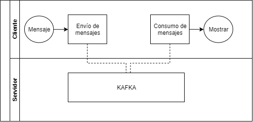
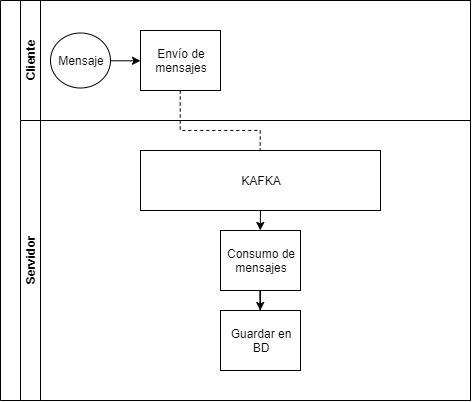

# Sistemas Distribuidos
Laboratorio de sistemas distribuidos del segundo semestre del año 2019, en donde se analizará el comportamiento de un servidor de Kafka al recibir mensajes, y guardarlos en dos bases de datos distintas, Postgres-SQL y Apache Ignite.

El sistema tiene dos modos, uno para realizar pruebas en donde los mensajes no se guardan en las bases de datos, y se muestran en tiempo real al cliente, como se muestra en la siguiente figura:



Y el segundo modo en donde los mensajes si se guardan en las bases de datos, sin necesidad que el cliente tenga que visualizarlos, como se muestra a continuación:



# Instalación y ejecución del proyecto
## Python
Se utiliza Python 3, en donde para instalar los módulos utilizados se necesita ejecutar los siguientes comandos:
```
pip3 install kafka-python
pip3 install python-twitter
pip3 install tweepy
```

## Ejecutar
Para utilizar los mensajes simples, utilizar el siguiente comando:
```
Python3 Main.py
```
NOTA: Si desea utilizar los mensajes de prueba, usar el archivo MainTest.

# Pruebas

Se realizan varios tipos de pruebas en dos categorías, primero, sin guardar los datos en las bases de datos y mostrando la salida en tiempo real al cliente como se aprecia en la figura 1, y luego guardando los datos en las bases de datos sin mostrar la salida al cliente en tiempo real como se aprecia en la figura 2.
## Sin guardar datos.
### Usando mensajes simples

Se realizan pruebas de estrés enviando al servidor mensajes simples. En este caso, se utilizan los códigos de MainTest.py, ProducerTest.py y ConsumerTest.py, en donde se envía hacia el servidor un contador que aumenta en 1 por cada envío, y luego se consume.

A continuación, se muestran los mensajes por segundo obtenidos, donde la consola de la izquierda es el productor y la consola de la derecha el consumidor:


### Usando tweets

## Guardando datos.
### Usando mensajes simples

### Usando tweets
