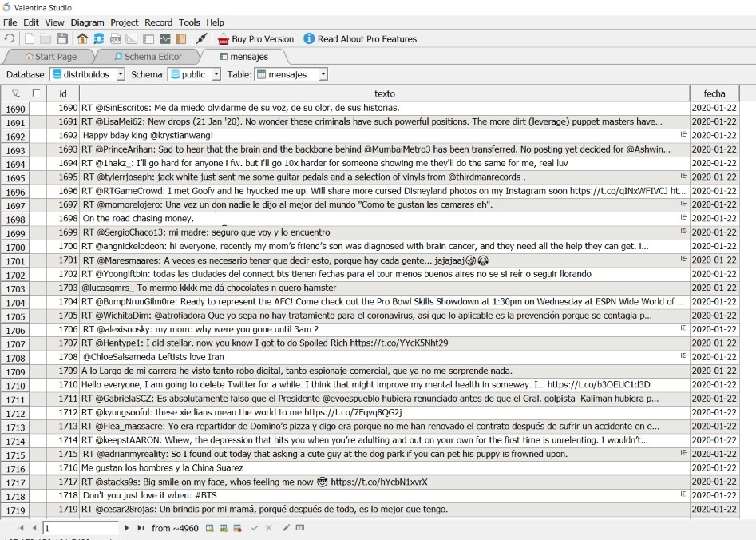

# Sistemas Distribuidos
Laboratorio de sistemas distribuidos del segundo semestre del año 2019, en donde se analizará el comportamiento de un servidor de Kafka al recibir mensajes, y guardarlos en dos bases de datos distintas, Postgres-SQL y Apache Ignite.

El sistema tiene dos modos, uno para realizar pruebas en donde los mensajes no se guardan en las bases de datos, y se muestran en tiempo real al cliente, como se muestra en la siguiente figura:


*Figura 1: Sistema en modo cliente-servidor-cliente*

Y el segundo modo en donde los mensajes si se guardan en las bases de datos, sin necesidad que el cliente tenga que visualizarlos, como se muestra a continuación:


*Figura 2: Sistema en modo cliente-servidor*

# Instalación y ejecución del proyecto
## Python
Se utiliza Python 3, en donde para instalar los módulos utilizados se necesita ejecutar los siguientes comandos:
```
pip3 install kafka-python
pip3 install python-twitter
pip3 install tweepy
pip3 install psycopg2-binary
pip3 install pyignite
pip3 install redis
```

## Ejecutar
Para utilizar los mensajes simples, utilizar el siguiente comando:
```
python3 Main.py
```
NOTA: Si desea utilizar los mensajes de prueba, usar el archivo MainTest.

# Pruebas

Se realizan varios tipos de pruebas en dos categorías, primero, sin guardar los datos en las bases de datos y mostrando la salida en tiempo real al cliente como se aprecia en la figura 1, y luego guardando los datos en las bases de datos sin mostrar la salida al cliente en tiempo real como se aprecia en la figura 2.
## Cliente-Servidor-Cliente.
### Usando mensajes simples

Se realizan pruebas de estrés enviando al servidor mensajes simples. En este caso, se utilizan los códigos de MainTest.py, ProducerTest.py y ConsumerTest.py, en donde se envía hacia el servidor un contador que aumenta en 1 por cada envío, y luego se consume.

A continuación, se muestran los mensajes por segundo obtenidos, donde la consola de la izquierda es el productor y la consola de la derecha el consumidor:


De acuerdo a esto, al monitorizar el servidor, se presentan los siguientes datos:


### Usando tweets


Para los tweets en tiempo real se obtiene lo siguiente:


Obteniendo una media de 53 tweets por segundo consumidos aproximadamente.

Donde en el servidor se presentan los siguientes datos:


Además, se realiza una prueba enviar 160.000 tweets primero, y luego consumirlos, dando los siguientes resultados:


Obteniendo una media de 179 tweets por segundos consumidos aproximadamente.

Mientras que en el servidor se obtienen los datos de a continuación:


## Cliente-Servidor.

Para tener una idea de como se comportan los mensajes al llegar al servidor, se genera la visualización de los mensajes sin guardarlos en ninguna base de datos, dando lo siguiente:


Además, en cuanto a los recursos del servidor, se tienen los siguientes datos:


Donde se aprecia que el consumo de memoria ram aumenta bastante, lo que se conlleva con Apache Ignite y Redis, las cuales son bases de datos en memoria.

### Usando mensajes simples

#### PostgreSQL

Al igual que antes, primero se realiza una prueba al guardar datos simples en postgres, dando los siguientes datos:


En cuanto al servidor, se genera el siguiente estado:


Donde se visualiza un aumento de escritura en disco.

En cuanto a los mensajes guardados, se obtiene lo siguiente:


#### Apache Ignite

En cuanto a Apache Ignite, al guardar los mensajes simples se visualiza lo siguiente:


Mientras que en el servidor se presenta lo siguiente:


#### Redis

Mientras que con Redis, se tienen los siguientes datos:


Con el servidor se visualiza lo siguiente:


### Comparación

Estas pruebas se realizaron al enviar 50.000 mensajes simples, dando los siguientes tiempos en guardar todos los mensajes para cada base de datos:
| Base de Datos | Tiempo Total |
| ------------- | ------------- |
| Postgresql  | 4:17  |
| Apache Ignite  | 3:29  |
| Redis  | 2:10  |

Y de acuerdo a esto, calculando la cantidad de mensajes por segundo guardados se obtendría lo siguiente:
| Base de Datos | Mensajes por Segundo |
| ------------- | ------------- |
| Postgresql  | 194  |
| Apache Ignite  | 239  |
| Redis  | 384  |


### Usando tweets

#### PostgreSQL

En cuanto al utilizar un flulo de tweets, se dan los siguientes datos:


En el servidor se presenta lo siguiente:


En cuanto a los mensajes guardados, se visualizan de la siguiente manera:


#### Apache Ignite

Para Apache Ignite, se presenta lo siguiente:


Mientras que en el servidor se obtienen los siguientes datos:


#### Redis

Finalmente, en cuanto a Redis se da lo siguiente:


En este caso, el servidor queda de la siguiente manera:


#Conclución

Al realizar las distintas pruebas, se observa un gran aumento del rendimiento al utilizar las bases de datos de Ignite y Redis respecto a Postgres, lo cuál nos indica el buen rendimiento de las bases de datos en memoria. Aunque cabe destacar que es necesario tener una máquina potente en cuanto a RAM, debido a que estas bases de datos consumen bastante.

Nos sorprendió el rendimiento de Redis por sobre las otras, debido a que no solo fué la más rápida, si no que además fue la que menos recursos utilizó.

En cuanto a Kafka, es primera vez que nos topamos con un sistema como este, por lo que nos sorprendió lo que es capaz de lograr. El hecho de poder procesar cada mensaje de acuerdo a como van llegando, y poder irlos guardando en una cola es una herramienta muy útil para un mundo basado en comunicaciones como es el nuestro.
